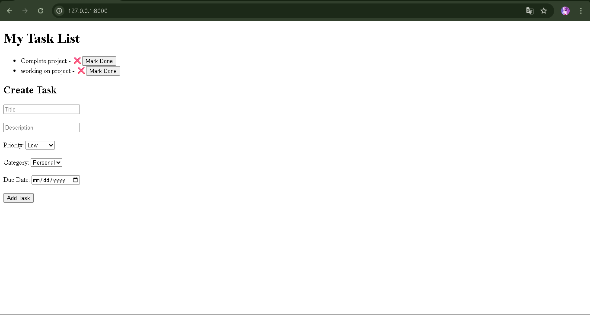
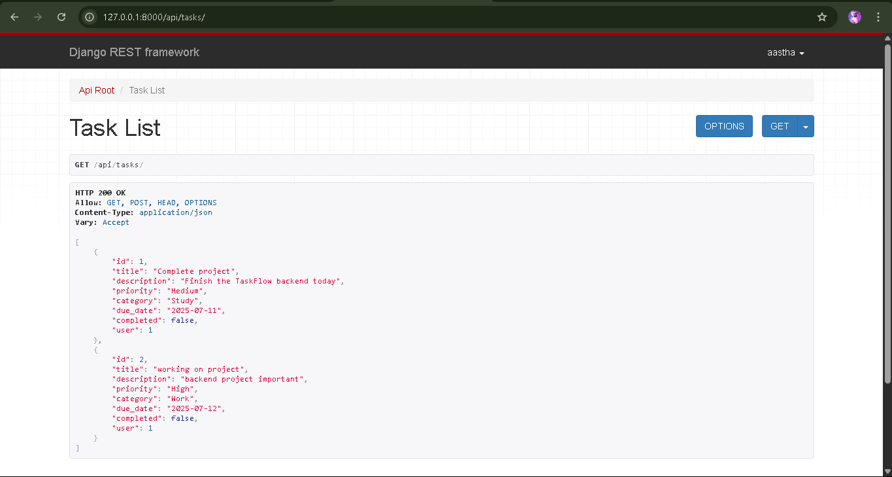
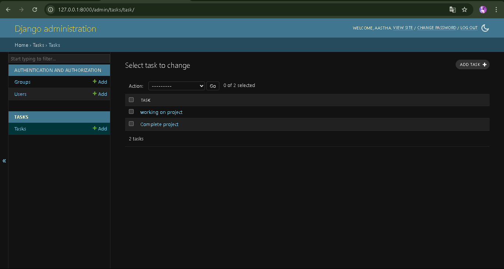

# 📝 TodoList Django Project

This is a full-stack **To-Do Task Manager** built using Django and JavaScript (vanilla) as part of an internship submission.

## ✅ Features

- User-authenticated task creation
- Create, view, update, and mark tasks complete/incomplete
- HTML form connected to Django REST API
- CSRF-secured POST requests via `fetch()`
- Admin panel to manage tasks

## 💻 Tech Stack

- Backend: Django, Django REST Framework
- Frontend: HTML, CSS, JavaScript
- Database: SQLite (default)

## 📸 Screenshots

### Frontend (http://127.0.0.1:8000/)


### API (http://127.0.0.1:8000/api/tasks/)


### Admin Panel (http://127.0.0.1:8000/admin/tasks/task/)


## 🚀 How to Run

```bash
git clone  https://github.com/aastha77/todolist-django-project.git
cd todolist_project
pip install -r requirements.txt
python manage.py migrate
python manage.py createsuperuser
python manage.py runserver

🙋‍♀️ Made with ❤️ by Aastha Pandey


---
